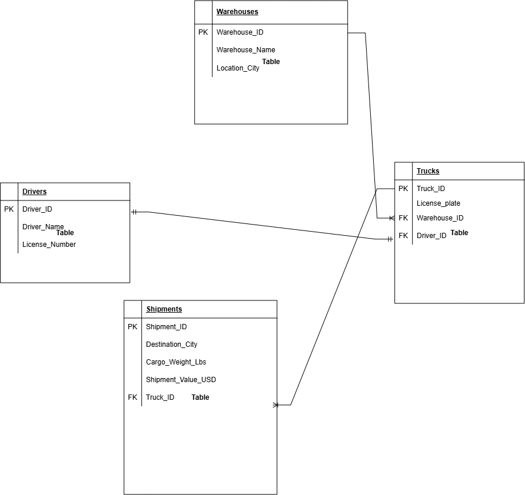

# Enterprise Logistics Relational Database Infrastructure
### Secure, Cross-Platform Deployment & Disaster Recovery Pipeline

## 📊 Executive Project Overview
This enterprise portfolio project demonstrates an end-to-end implementation of a secure, relational logistics database tracking network. The objective was to design a scalable database schema managing a regional Midwest shipping fleet, deploy the environment across separate operating system platforms, enforce strict network security controls, and architect an automated cross-platform disaster recovery automation pipeline.

---

## 🎨 1. Database Architecture & Design (CompTIA DataSys+)
The database model was architected using **Crow's Foot Notation** to enforce strict real-world business constraints across four core tables:

*   **Warehouses & Drivers (Independent Parents)**: Built with auto-incrementing identity keys (`INT IDENTITY(1,1) PRIMARY KEY`) and rigid nullability boundaries (`NOT NULL`).
*   **Trucks (Fleet Layer)**: Implements standard 1:Many parent-to-child indexing back to regional warehouse hubs, while executing a strict **One-to-One (1:1)** cardinality mapping on the driver interface via an explicit `UNIQUE FOREIGN KEY` constraint.
*   **Shipments (Transactional Layer)**: Tracks cargo manifests using high-precision financial tracking variables (`DECIMAL(10,2)`) to eliminate float-rounding errors across heavy transaction metrics.

### Verification Matrix (Relational Inner Join)



Data integrity was tested and verified using complex multi-table `INNER JOIN` operations to map active freight routes to individual operators on the fly:
```sql
SELECT S.Shipment_ID, S.Destination_City, S.Shipment_Value_USD, T.License_Plate, D.Driver_Name
FROM Shipments S
INNER JOIN Trucks T ON S.Truck_ID = T.Truck_ID
INNER JOIN Drivers D ON T.Driver_ID = D.Driver_ID;
```

---

## ⚙️ 2. Systems Engineering & Cross-Platform Virtualization
The production database engine was detached from the administration workspace to maximize performance and mirror enterprise constraints:
*   **Hypervisor Layer**: Provisioned an isolated Virtual Machine environment inside **Microsoft Hyper-V**, tuning physical resource allocations and dynamic memory mapping rules.
*   **Database Engine**: Deployed and initialized **Microsoft SQL Server 2022 on Ubuntu Server Linux**.
*   **Network Binding Configuration**: Modified core system-level parameters inside `mssql.conf` to bind network listeners to `0.0.0.0`, enabling secure cross-platform data processing across distinct private IP pools.

---

## 🔐 3. Infrastructure Security Hardening & Perimeter Control
To protect corporate data assets against external intrusion vectors, the Linux kernel was hardened through custom perimeter access tables:
*   **Firewall Isolation**: Deployed **Ubuntu's Uncomplicated Firewall (UFW)** to block all incoming network connections by default.
*   **Port-Level Exceptions**: Programmed strict exceptions allowing inbound TCP data traffic explicitly through **Port 1433** (Microsoft SQL Server Engine) and **Port 22** (Secure Shell Administration).
*   **Credential Lifecycle Control**: Executed root-level system overrides via `set-sa-password` inside the Linux terminal to enforce enterprise-grade master access keys.

---

## 🤖 4. Disaster Recovery & Automation Pipeline
Disaster recovery mechanics were fully automated via a custom **PowerShell scripting runner** executed directly from an administrative Windows workstation:
1.  **Dynamic Snapshotting**: The script triggers a remote T-SQL transaction over Port 1433 using the `SqlServer` module framework, causing the Linux engine to lock its file states and generate a timestamped `.bak` database archive.
2.  **Cross-Platform File Routing**: Utilizes native **Secure Copy Protocol (SCP)** to bypass restricted system directory boundaries, safely transferring the 4.7 MB production snapshot out of the Linux environment and archiving it locally inside a custom Windows retention directory (`C:\LogisticsBackups\`).
